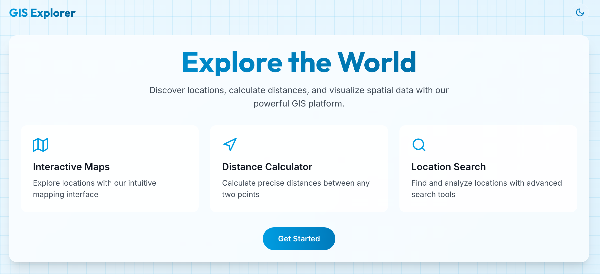

# Geospatial API with FastAPI and Next.js




A modern full-stack application template featuring advanced geospatial capabilities using FastAPI for the backend and Next.js for the frontend.

## Features

### Backend (FastAPI)
- **Location Management**
  - CRUD operations for geospatial locations
  - Category-based location organization
  - Elevation and metadata support
  - Input validation for coordinates

- **Spatial Analysis**
  - Distance calculations with bearing
  - Efficient nearby location search using R-tree spatial indexing
  - Location clustering using DBSCAN-like algorithm
  - Category-based filtering
  - Bounding box optimizations

- **Performance Optimizations**
  - Spatial indexing for O(log n) queries
  - Bounding box pre-filtering
  - Efficient cluster detection

### Frontend (Next.js)
- Modern UI with Tailwind CSS
- Interactive location management
- Real-time distance calculations
- Cluster visualization
- API status monitoring

## Project Structure

```
.
├── backend/           # FastAPI backend
│   ├── app/
│   │   ├── main.py
│   │   ├── models.py
│   │   └── routers/
│   │       ├── gis.py
│   │       └── gui.py
│   ├── requirements.txt
│   └── README.md
├── frontend/         # Next.js frontend
│   ├── src/
│   │   ├── app/
│   │   ├── components/
│   │   └── styles/
│   ├── package.json
│   └── README.md
└── README.md
```

## Backend Setup

1. Navigate to the backend directory:
   ```bash
   cd backend
   ```

2. Create a virtual environment:
   ```bash
   python -m venv venv
   source venv/bin/activate  # On Windows: venv\Scripts\activate
   ```

3. Install dependencies:
   ```bash
   pip install -r requirements.txt
   ```

4. Run the development server:
   ```bash
   uvicorn app.main:app --reload
   ```

The backend will be available at `http://localhost:8000`

## Frontend Setup

1. Navigate to the frontend directory:
   ```bash
   cd frontend
   ```

2. Install dependencies:
   ```bash
   npm install
   ```

3. Run the development server:
   ```bash
   npm run dev
   ```

The frontend will be available at `http://localhost:3000`

## API Endpoints

### Location Management
- `POST /gis/locations` - Create a new location
- `GET /gis/locations` - Get all locations
- `GET /gis/locations/{id}` - Get a specific location

### Spatial Analysis
- `POST /gis/distance` - Calculate distance between points
- `POST /gis/nearby` - Find locations within radius
- `GET /gis/clusters` - Find clusters of nearby locations

## Development

- Backend API documentation is available at `http://localhost:8000/docs`
- Frontend development server includes hot reloading
- Both servers can run simultaneously for full-stack development

## Production Deployment

For production deployment:

1. Build the frontend:
   ```bash
   cd frontend
   npm run build
   ```

2. The backend can be deployed using any ASGI server (e.g., Gunicorn with Uvicorn workers)

## Future Enhancements

1. **Data Persistence**
   - PostgreSQL with PostGIS integration
   - Database-level spatial indexing
   - Advanced spatial queries

2. **Advanced Spatial Analysis**
   - Convex hull calculations
   - Spatial interpolation
   - Route optimization
   - Geofencing

3. **Visualization**
   - GeoJSON export
   - Heatmap generation
   - Cluster visualization
   - Elevation profiles

4. **Data Quality**
   - Coordinate validation
   - Reverse geocoding
   - Elevation data integration
   - Quality metrics

5. **Performance**
   - Query metrics
   - Spatial query caching
   - Optimization hints

## Contributing

1. Fork the repository
2. Create a feature branch
3. Commit your changes
4. Push to the branch
5. Create a Pull Request 